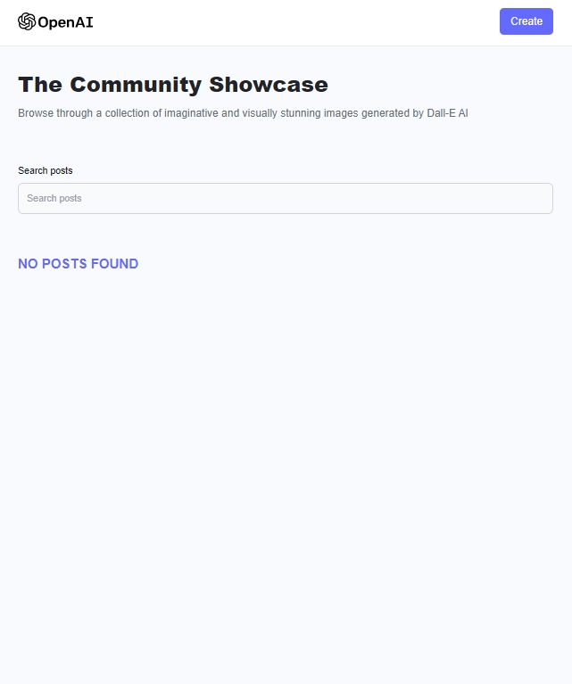
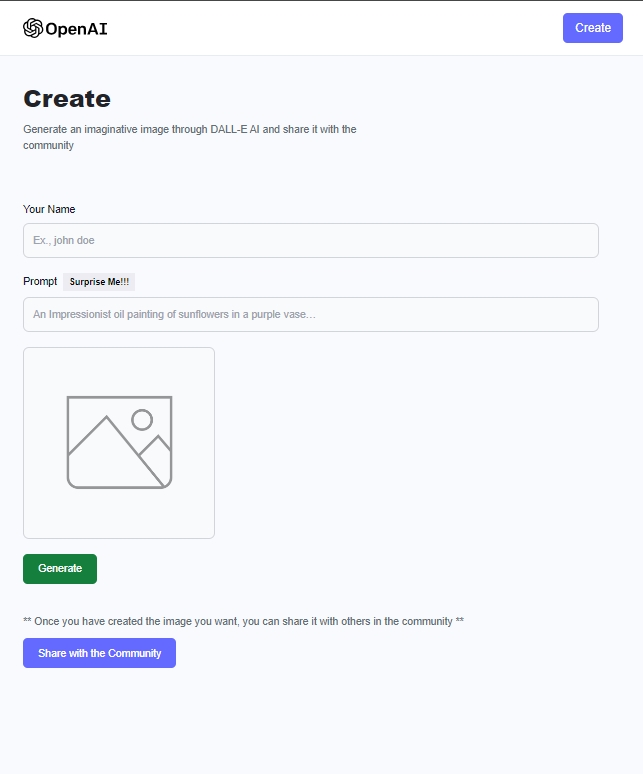

[![LinkedIn][linkedin-shield]][linkedin-url]


# Welcome to my Ai image generator project.

### Homepage 
     


   

### Create Post page    
    



## Hosting Serve - Back-End

The Back-End of the website is hosted on Render.
    
## Hosting Serve - Front-End
   
The Front-End of the website is hosted on Hostinger.
    
## Cloud

The website is host on the cloud thanks to Cloudinary.

## NPMs for the Client Side of the project

```bash

 npm create vite@latest ./

 npm install

 npm install -D tailwindcss postcss autoprefixer

 npx tailwindcss init -p

 npm install file-saver

 npm install react-router-dom

```


NPMs for the Server Side of the project

```bash

 npm init -y

 npm install cloudinary cors dotenv mongoose nodemon openai

 npm install mongodb

```


[linkedin-shield]: https://img.shields.io/badge/-LinkedIn-black.svg?style=for-the-badge&logo=linkedin&colorB=555
[linkedin-url]: https://www.linkedin.com/in/justin-bucsa